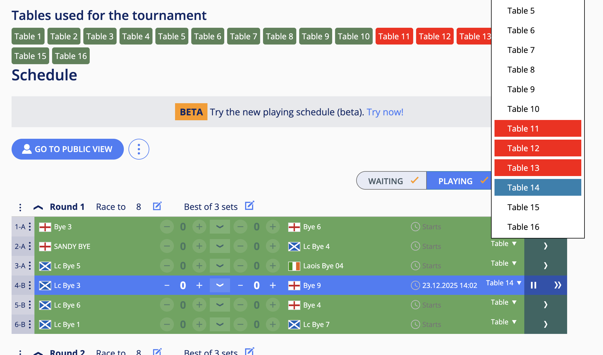

# csplanner
Helpers for cuescore managers

The code here is primarily to be used on mobile devices or tablets when visiting a cuescore tournament page that you have edit access over.

The minified planner.js should be saved as a javascript bookmark.
A tool like https://caiorss.github.io/bookmarklet-maker/ can be used

Once in a cuescore tournament page, you type the name of the bookmark created above in the address bar and you select it. After that the following will be made available

1. Rows of games that can be started will be marked with a green color
2. A table on/off section will be showed (deactivating a table will show it as red on the table selector)
3. the table selector shows the same info as in the windows desktop version (tables in use are highlighted differently)

